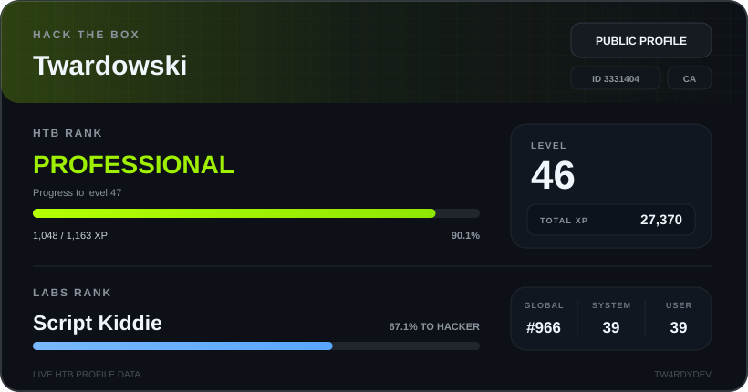
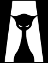
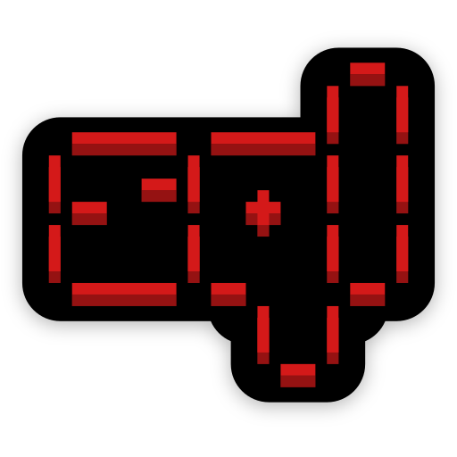

# TWARDY.exe

`cybersecurity` · `offensive security` · `networking`

---

## 💎 About

Focused on **offensive security, networking, and practical security tooling**.

I like building things, breaking things in controlled environments, and understanding what actually happens underneath the surface.

Currently working on security tools, network utilities, labs, and infrastructure projects.

---

## 🛰️ Current focus

- Offensive Security
- Network Security
- Python
- Linux
- Security Tooling
- Homelab Infrastructure
- Hack The Box

---

## 🧪 Selected work

### [TwardyPass](https://github.com/TW4RDYDEV/TwardyPass)
Privacy-first password security workbench with local strength analysis, breach intelligence, secure generation, and a modern PySide6/QML interface.

### [network-scanner](https://github.com/TW4RDYDEV/network-scanner)
Python desktop application for discovering active devices on local networks.

---

## 📡 Hack the box

---

## 🎧 Track

 

&nbsp;&nbsp;&nbsp; <b>APOLLO</b> 
&nbsp;&nbsp;&nbsp; Avi · Louis Villain · Sarius  
&nbsp;&nbsp;&nbsp; <a href="https://open.spotify.com/track/2S13g8BhBuFzkGpwDw1ONM">Listen on Spotify ↗</a>

 
 

---

## ⚙️ Stack

### Development

   

### Security & networking

  
  &nbsp;&nbsp;
  
  &nbsp;&nbsp;
  
  &nbsp;&nbsp;
  <a href="https://www.flaticon.com/free-icons/top-hat" title="top hat icons">Top hat icons created by Smashicons - Flaticon</a>
  &nbsp;&nbsp;
  
  &nbsp;&nbsp;
  
  &nbsp;&nbsp;
  
  &nbsp;&nbsp;
  
  &nbsp;&nbsp;
  

  

### Systems & Virtualization

   

### Frameworks & Interfaces

   

### Tools & Workflow

---

## 🤝 Work with me

I'm open to **collaborations, cybersecurity projects, security tooling, labs, networking projects, and interesting ideas in general**.

If you're building something and think I could contribute, need help with a project, or just want to talk cybersecurity — feel free to reach out.

**Email:** [devtwardowski@gmail.com](mailto:devtwardowski@gmail.com)

---

building quietly.

